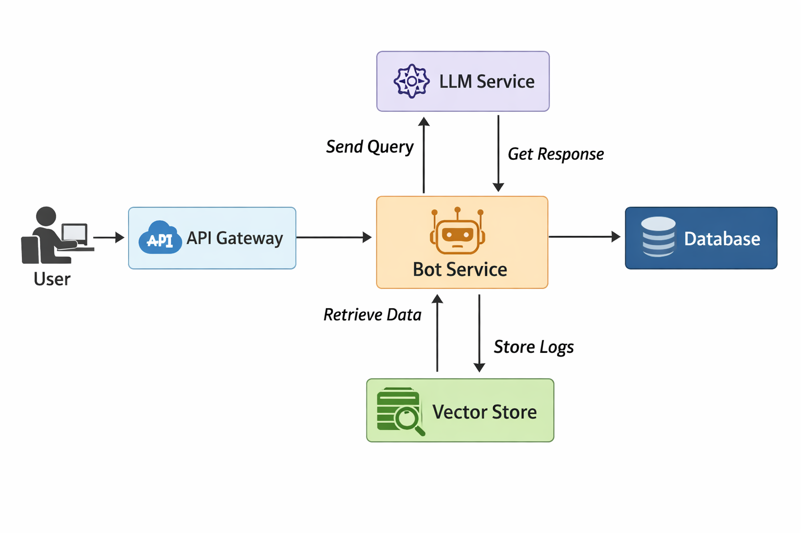

# System Architecture

The diagram below illustrates the high-level architecture of the **Enterprise‑Sundai‑Bot**. It shows how user requests flow through the API layer, into the core AI services and data stores.

## Components

1. **User Interface** – The chatbot can be accessed via web, mobile or chat platforms. It communicates with the API gateway using HTTPS.
2. **API Gateway** – Manages authentication, rate limiting and routing of requests to backend services.
3. **Bot Service** – Orchestrates intent detection, slot filling and business logic. It also interfaces with the RAG ingestion pipeline when needed.
4. **LLM Service** – Provides language generation and understanding. May call external LLM providers or run on‑premise models.
5. **Vector Store** – Stores embeddings produced from documents for retrieval‑augmented generation.
6. **Database** – Stores user profiles, conversation history and configuration data.

This architecture is flexible and can be extended with additional services such as analytics, monitoring and security modules. See the [rag_ingestion.py](../src/rag_ingestion.py) for a pipeline stub.